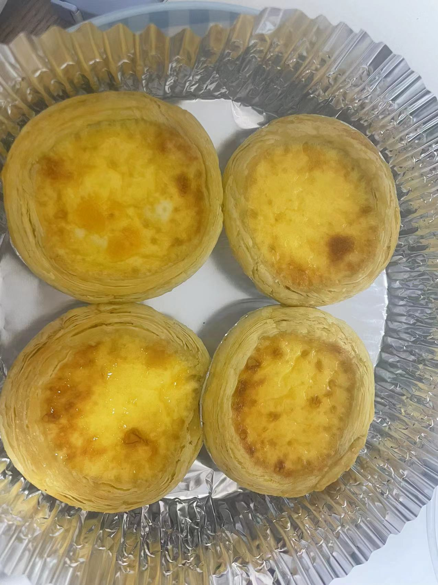

# 蛋挞制作步骤

我比较喜欢吃蛋挞，刚好对象买了个烤箱，所以准备做着试试看

致谢对象**小玉同学**，感谢长久以来的关心和鼓励

在制作蛋挞前，你需要的**前置准备**

1. **买入**蛋挞皮
2. 准备烤箱

::: danger
蛋挞皮购入后需要立马放入冰箱后进行冷藏保存，否则各个蛋挞皮会粘在一起
:::

## 简易版本

::: tip
牛奶推荐使用两侧有夹角可以剪开的

两边使用剪刀剪开后还可以再还原回去，避免因过多接触空气而导致变质.
:::

该版本为**懒人专属**，不想花费太多时间又想吃到口感不错的蛋挞 ***publish time 2024-06-08***

1. 制作蛋挞液
   1. 买入鸡蛋、牛奶、白砂糖，然后搅拌到一起
   2. 然后倒入点白醋，去点腥味
2. 烤箱预热 **5**分钟，**180**度
3. **5**分钟内将**蛋挞液**倒入至蛋挞皮，**80**%即可
4. 烤**20**分钟

### 简易版本 -- 测试时间 2024-06-08

**diff with standard version**:

    1. 烤箱预热 5分钟 200度
    2. 没放白醋
    3. 糖放的比较多

**output**

口感很好，但是感觉蛋挞液可以多放点膨胀起来好看些

