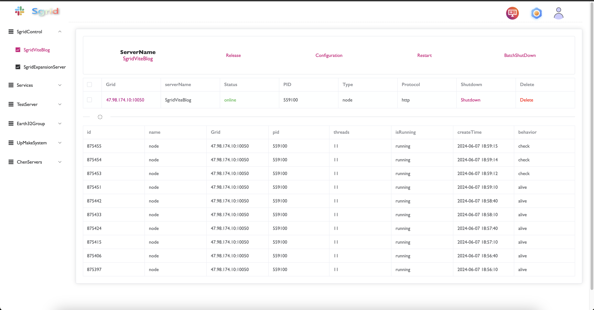
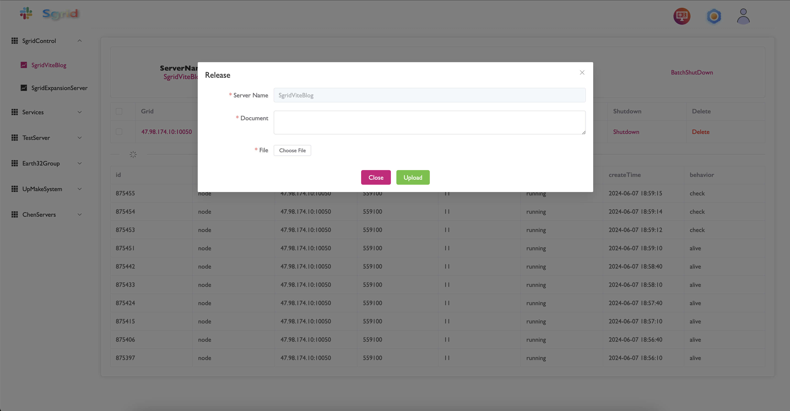
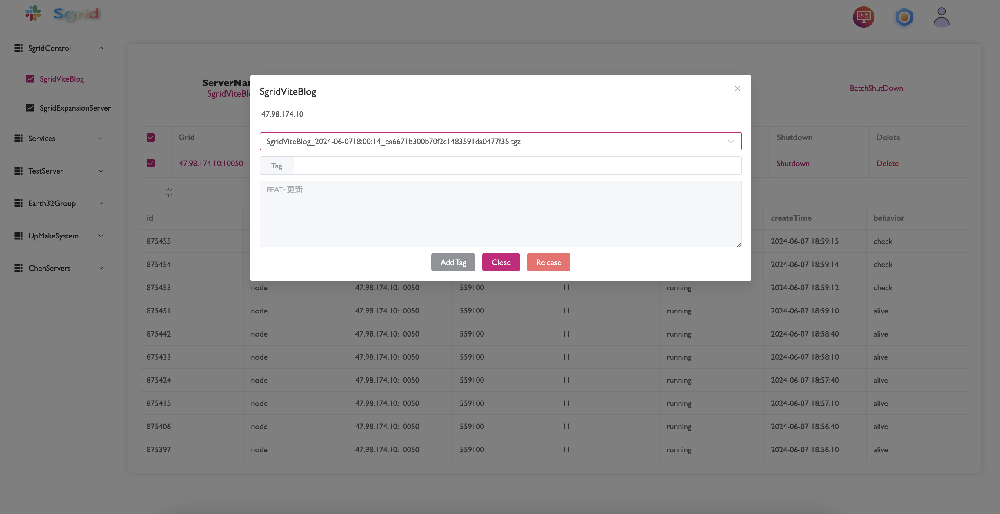
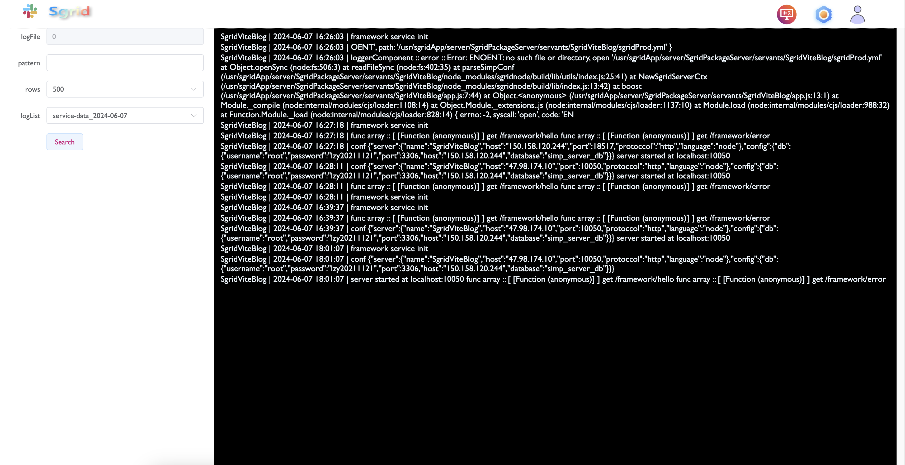
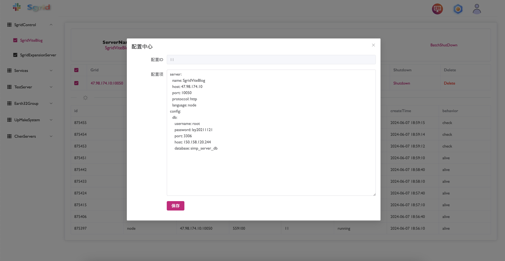

# SgridFramework

## 服务发布流程

**首先需进入主页，然后在左侧选择服务，点击后右侧会展示服务状态清单。**

**主页**

**点击服务名称，弹出服务发布的内容**

**选择服务包进行发布**

**等待30秒之后再次点击左侧服务刷新状态。如果status为online，则表示发布成功。**

**如果有问题，可以点击节点(Grid)跳转到日志界面进行查看**

## 部署与扩容流程

**Todo**

## 配置中心

都是yml格式的内容，直接将配置复制到该文本域即可。

## 权限管理

**todo**
