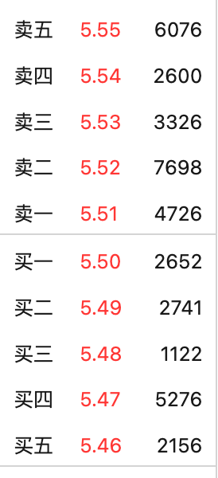

# 基本交易知识

## 委托单状态

1. 待撤：撤单指令还未报到场内。
2. 正撤：撤单指令已送达公司，正在等待处理，此时不能确定是否已进场；
3. 部撤：下单指令中的一部份数量已被撤消；
4. 已撤：委托指令全部被撤消；
5. 未报：下单指令还未送入数据处理；
6. 待报：下单指令还未被数据处理报到场内；
7. 正报：下单指令已送达公司，正在等待处理，此时不能确定是否已进场；
8. 已报：已收到下单反馈；
9. 部成：下单指令部份成交；
10. 已成：下单指令全部成交；
11. 撤废：撤单废单，表示撤单指令失败，原因可能是被撤的下单指令已经成交了或场内无法找到这条下单记录；
12. 废单：交易所反馈的信息，表示该定单无效

## 股票交易方式之限价委托与市价委托

1、限价委托与市价委托的定义

限价委托，是指投资者在发出买卖股票的指令时，对买卖的价格作出限制，按照限定价格或者高于限定价格卖出股票，或者按照限定价格或者低于限定价格买入股票的一种委托方式。

市价委托，是指投资者对委托券商成交的股票价格没有限制条件，只要求立即按当前的市价进行证券买卖的一种委托方式。

2、限价委托的特点

1、限价委托可以以低于市价的价格买入股票或者是高于市价的价格卖出股票，能够给投资者带来较大的利润，实现自身设定的投资计划。

2、限价委托必须要与市价有一定的差价，需要等到股价运行到限价位置才有可能成交。如果同时有市价委托在同一价格上，那么市价委托会先成交。

3、在股价波动较大情况下，限价委托有可能会比市价委托承受损失更大，也更容易错失更好的入场和出场机会。

3、限价委托和市价委托的区别

限价委托和市价委托最主要的区别是有没有对成交价格做出限制。

市价委托是没有对成交价格做出限制的，不管股价怎么波动，即时价格就是成交价。而限价委托是需要股价达到投资者规定的价格才能卖出或买进股票。市价委托也是优先于限价委托，在价格相同时，优先成交市价委托。

与市价委托相比，限价委托有可能获得更高的利润，也有出现更大亏损的情况，不确定性较大。而市价委托能够保证投资者者的指令及时成交，提高了市场效率。

总的来说，不管是限价委托还是市价委托，都是投资者选择交易的一种方式，我们对其了解后，可以提高成交效率，避免出现无法成交而造成不必要的损失。

## 注册制新股

新股：新股上市前5天不设涨跌幅。也就是新股上市没有了一字涨停板了，你再去挂隔夜单已经毫无意义，以后的新股破发可能会像现在得创业板一样破发也是常态了，以后不能再无脑打新了，打新申购之前一定要先了解这家公司的基本面，有没有打新的价值。

## 可转债市场

::: tip
部分需求要求可转债交易时文字变为**张**数，且步进为0.001
:::

在沪市上市的可转债代码以“11”开头，在深市上市的可转债代码以“12”开头

沪市与深市的交易单位也不同，沪市的交易单位是1手，深市的交易单位是10张。但其实这只是叫法不同，1手和10张指的都是10张可转债

## 五档盘口

五档盘口：

股票交易软件中的右上角，会显示出股票买入卖出的数据，也可以看出来价格的高低顺序如何。通常情况下，在股票行情软件上分别显示买卖各五个价格。

即：买一、买二、买三、买四、买五;

即：卖一、卖二、卖三、卖四、卖五;

也就是同一时间可以看到5个买盘价格和5个卖盘价格。未成交的最低卖价就是卖一，未成交的最高买价就是买一，其余类推。股票价格右边的蓝黄条，代表该价格上的总委托数量，也有些软件直接显示委托数量（单位有的用手数，有的用万股，不一而足）。委托买入和委托卖出的价格最接近的各5档价格和委托手数，股票五档的数据是委托买入和卖出的报价以及委托量，代表当时的股票行情。

**五档交易.png**

若你想买入股票，当你报价高于卖一，即高于5.51元的任何价位，就可即时成交，成交价是5.51元。如果你的报价是5.49元，那么你就跟其他报价5.49元买入的投资者一起排队等候。等到即市价格跌至5.49元，你才有机会成交。股市中的五档盘口
